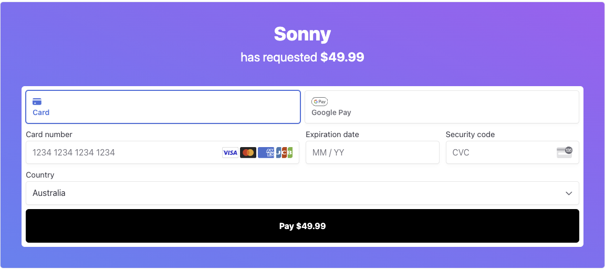

## Overview

This project demonstrates how to integrate Stripe Payment Elements into a Next.js 14 application. The application sets up a secure payment form, handles user input, and processes payments securely. The focus is on leveraging HTTPS and ensuring secure transactions.



## Features

- **Secure Payment Form**: Utilizes Stripe's Payment Elements for a seamless payment experience.
- **HTTPS Setup**: Ensures secure communication between the client and server.
- **Environment Configurations**: Securely manages sensitive data using environment variables.
- **Error Handling**: Provides robust error handling during payment processing.
- **Deployment Ready**: Configured for deployment on platforms like Vercel or Netlify.

## Getting Started

### Prerequisites

- Node.js (v14+)
- Next.js (v14)
- Stripe Account

### Installation

1. Clone the repository:

   ```bash
   git clone https://github.com/liuyuelintop/stripe-payment-elements-with-https-nextjs-14-demo-study.git
   cd stripe-payment-elements-with-https-nextjs-14-demo-study
   ```

2. Install dependencies:

   ```bash
   npm install
   ```

3. Set up environment variables:

   Create a `.env.local` file in the root directory and add your Stripe keys:

   ```bash
   NEXT_PUBLIC_STRIPE_PUBLIC_KEY=your_public_key
   STRIPE_SECRET_KEY=your_secret_key
   ```

4. Start the development server:

   ```bash
   npm run dev
   ```

   The application will be available at `http://localhost:3000`.

## Deployment

The project can be deployed using any platform that supports Next.js, such as Vercel or Netlify. Ensure that the environment variables are set up correctly in the hosting environment.

## Contributing

Contributions are welcome! Please open an issue or submit a pull request with your changes.

## License

This project is licensed under the MIT License.

## Acknowledgments

- [Stripe Documentation](https://stripe.com/docs)
- [Next.js Documentation](https://nextjs.org/docs)
- [Sonny Sangha&#39;s Stripe Integration Guide](https://www.youtube.com/watch?v=fgbEwVWlpsI)

## Additional Resources

- [Stripe Payment Elements Documentation](https://stripe.com/docs/payments/elements)
- [Next.js with HTTPS Guide](https://nextjs.org/docs/advanced-features/security-headers)

---

This README provides a comprehensive overview of the project, ensuring that new contributors and users can understand and set up the project efficiently.
